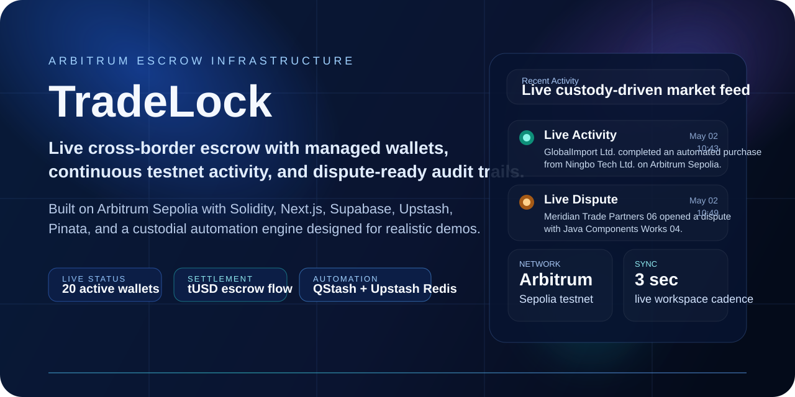
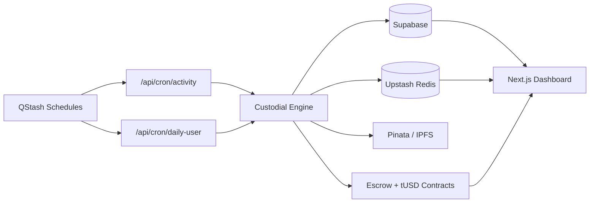
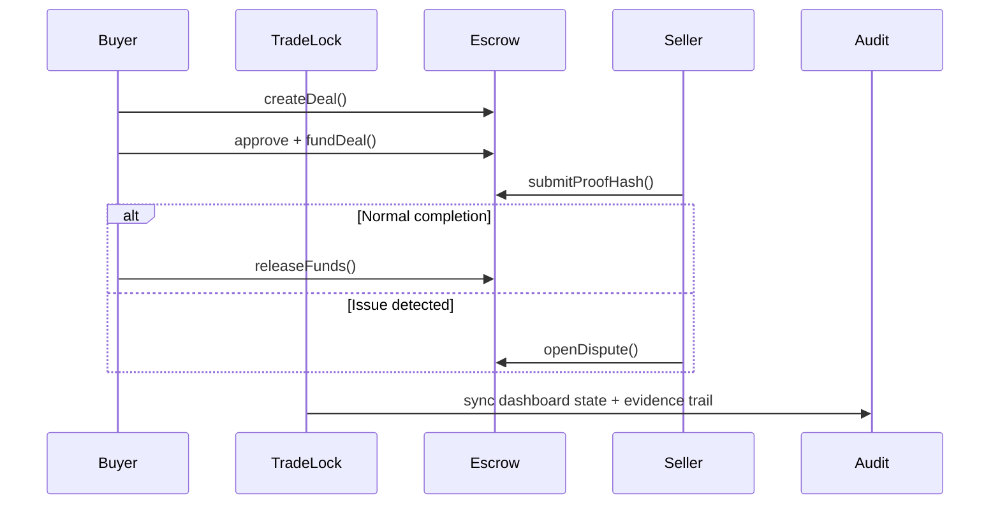

# TradeLock

<p align="center">
  
</p>

<p align="center">
  <strong>Cross-border escrow infrastructure for global B2B trade.</strong><br />
  Live managed wallets, automated testnet activity, dispute-ready audit trails, and a dashboard built to feel like a real operations product.
</p>

<p align="center">
  <a href="https://tradelock-pi.vercel.app"></a>
  
  
  
</p>

<p align="center">
  
  
  
  
  
  
</p>

<p align="center">
  
  
</p>

## Tagline

TradeLock turns a hackathon demo into a believable escrow operation:

- real managed wallets for buyers, sellers, and arbitration
- live on-chain activity on Arbitrum Sepolia
- an always-moving dashboard powered by QStash and Upstash
- proof uploads, dispute flows, and audit visibility end to end

## The Problem

Cross-border B2B trade often breaks down on the last mile of trust:

- buyers worry about paying before delivery is proven
- sellers worry about shipping without guaranteed settlement
- auditors and arbitrators need traceable evidence, not screenshots in chat
- most demos stop at mock rows and static dashboards, so they never feel operational

## The Solution

TradeLock provides a live escrow workspace that combines:

- Solidity escrow contracts and a test settlement asset (`tUSD`)
- a custody automation layer that provisions and funds managed wallets
- recurring market activity and daily wallet growth through QStash schedules
- a responsive operations dashboard for deals, disputes, counterparties, and audit trails

`tUSD` is a test settlement token used for repeatable hackathon escrow activity on Arbitrum Sepolia. The same contract flow can support USDC.

## What Is Live Right Now

- `20` managed active wallets across buyers, sellers, and arbitration
- recurring automated purchase and dispute activity on Arbitrum Sepolia
- live `Selected Deal` sync from the latest custody activity
- proof uploads to Pinata/IPFS
- Supabase-backed app state with Redis-assisted cache and custody registry

## Architecture





## Judge Guide

### 1. Open the live workspace

- Visit `https://tradelock-pi.vercel.app`
- Watch the top ticker and `Recent Activity` panel for live custody events

### 2. Inspect the dashboard

- `Live Custody Network` shows wallet counts and pool balances
- `Recent Deals` reflects the newest automated market activity
- `Selected Deal` follows the latest live custody event without manual reload

### 3. Review the operational surfaces

- `Deals`: escrow lifecycles and transaction states
- `Disputes`: open review items and linked counterparties
- `Audit Trail`: event-by-event activity history
- `Counterparties`: live directory of managed businesses

### 4. Understand what is being demonstrated

- all asset flows use testnet `tUSD`
- gas is paid with Arbitrum Sepolia ETH
- activity is intentionally continuous to simulate a real B2B network
- `tUSD` is used so judges can replay escrow activity safely and repeatedly; the same escrow contract flow can support USDC later

## Quick Start

```bash
npm install
cp .env.example .env.local
npm run dev
```

Open `http://localhost:3050`.

### Useful commands

```bash
npm run build
npm run test:e2e
```

## Stack

- Frontend: Next.js 16, React 19, Tailwind CSS 4, Framer Motion
- Chain: Arbitrum Sepolia
- Contracts: Solidity escrow + `tUSD` settlement token
- Web3: viem
- State and data: Supabase
- Automation and cache: Upstash Redis + QStash
- File proofs: Pinata / IPFS
- QA: Playwright

## Repository Structure

```text
app/                      Next.js app routes and APIs
components/               dashboard, screens, layouts, providers
contracts/                Solidity escrow and tUSD contracts
docs/                     README assets
lib/                      custody engine, backend, web3, services, types
tests/                    Playwright UI coverage
```

## Sync and Automation Notes

- custody activity is scheduled by QStash
- UI market sync runs on a tight cadence and follows custody changes
- dashboard detail panels use the latest live custody `dealId` as the preferred source
- daily wallet growth starts from the configured `dailyUserStartDate`

## Why Arbitrum Sepolia

TradeLock is currently optimized for a live hackathon demo:

- no real capital is required
- real wallet behavior is still visible onchain
- escrow, proof, and dispute flows can be demonstrated repeatedly
- the architecture remains portable to Arbitrum One later

## Contributing

Contributions are welcome. Start with [CONTRIBUTING.md](./CONTRIBUTING.md).

## License

This project is released under the [MIT License](./LICENSE).
